

# Índice

[Introducción al modelo de aprendizaje PAC](#modelo-de-aprendizaje-pac)

[Modelo PAC generalizado y predictores lineales: Perceptron](#modelo-pac-generalizado-y-predictores-lineales-perceptron)

# Modelo de aprendizaje PAC

Ejercicio 3 del capítulo 2 de Understanding machine learning. [Ver el código del programa](https://github.com/EstuarDiaz/MachineLearning/blob/master/PAC.ipynb)

Para poner en práctica los conceptos aprendidos, proponemos un problema de clasificación. Supongamos que tenemos un cuadrado $$X = [0,2] \times [0,2]$$ y queremos clasificar los puntos de $$X$$ en dos tipos: los que pertenecen a $$X_0$$ y los que pertenecen a $$X_1$$, donde $$X_1 = [1-\frac{1}{\sqrt 2},1+\frac{1}{\sqrt 2}] \times [1-\frac{1}{\sqrt 2},1+\frac{1}{\sqrt 2}]$$ y $$X_0 = X - X_1$$.

Queremos utilizar el modelo de aprendizaje PAC para resolver este problema y por lo tanto asumimos realizabilidad. Proponemos una clase de hipótesis finita y utilizamos un algoritmo ERM para obtener una hipótesis que minimize el error empírico. Realizamos este proceso varias veces con diferentes tamaños de muestras, para comprobar las cotas teóricas de error y probabilidad, dadas por la complejdad de la muestra de una clase de hipótesis finita.

Proponemos nuestra clase de hipótesis finita como el espacio de rectángulos, tales que la esquina inferior izquierda este centrada y la posición del rectángulo como el tamaño esta cuantizada, en intervalos $$\Delta = 0.01$$.

### Especificamos una parametrización del espacio de hipótesis.

Sea $$H = \{R(x_1,y_1,x_2,y_2) : x_1=y_1, 0 \leq x_1 < x_2 \leq 2,  0 \leq y_1 < y_2 \leq 2\}$$

### ¿Cuál es el tamaño del espacio de hipótesis?

Sea $$\Delta = 0.01$$. Calculemos $$ \mid H \mid $$:

- Tenemos que $$x_1 = y_1$$ pueden tomar $$2/\Delta$$ valores
- Luego, $$x_2,y_2$$ pueden tomar $$\frac{2-x_1}{\Delta}$$ valores
  Entonces $$\mid H \mid = \Big(\sum_{k=0}^{2/\Delta-1} \frac{2-k\Delta}{\Delta}\Big)^2 =  \Big(\sum_{k=0}^{2/\Delta-1} \frac{2}{\Delta} - k\Big)^2 = \Big(\frac{2}{\Delta}\sum_{k=0}^{2/\Delta-1} 1 - \sum_{k=0}^{2/\Delta-1} k\Big)^2 $$ $$=  \Big(\frac{2}{\Delta}^2  - \frac{2/\Delta(2/\Delta -1)}{2}\Big)^2 = \Big(\frac{4}{\Delta^2} - \frac{2/\Delta - 1}{\Delta}\Big)^2 = \Big(\frac{4-2+\Delta}{\Delta^2} \Big)^2 = \Big(\frac{2+\Delta}{\Delta^2} \Big)^2$$

Por lo tanto, $$ \mid H \mid = \Big(\frac{2+\Delta}{\Delta^2} \Big)^2 = \Big(\frac{2+0.01}{0.01^2} \Big)^2 = 404,010,000$$

### Simplifiquemos la clase de hipótesis finitas a rectángulos con lados paralelos a los lados de $$X$$, centrados en $$X$$.

Como podemos notar, el tamaño de la clase de hipótesis propuesta es demasiado grande, considerando que el método para obtener la hipótesis ERM es probar una a una las clases de hipótesis. Por lo tanto, vamos a reducir y simplificar nuestra clase de hipótesis al subconjuto de los rectángulos centrados en $$X$$. Nótese que sigue siendo válido el supuesto de realizabilidad.

### ¿Cuál es el tamaño de $$H$$?

La nueva clase de hipótesis esta definida por $$H = \{R(x_1,y_1,x_2,y_2) : x_1=y_1,x_2 = y_2, x_2 = 2 - x_1, y_2 = 2-y_1\}$$
Entonces $$\mid H \mid = \frac{2}{2\Delta} = \frac{1}{\Delta} = \frac{1}{0.01} = 100$$.

### Calculamos la probabilidad de extraer un ejemplo en cada una de las clases.

Por un lado, $$ P(x \in X_1) = \frac{(\frac{2}{\sqrt 2})^2}{2^2} = \frac{1}{2}$$ Por otro lado, $$P(x \in X_0) = 1 - P(x \in X_1) = 1 - \frac{1}{2} = \frac{1}{2}$$

### En python, definimos un conjunto de métodos que realizan las siguientes tareas:

Estos métodos nos servirán para realizar todas las corridas del proceso de obtener muestras, calcular errores empíricos y de generalización, así como de obtener la hipótesis que minimiza el error.

a) Formar conjuntos de entrenamiento $$S$$ con $$m$$ elementos

```markdown
# Obtener una muestra de m elementos
def getSample(m):
    return np.random.uniform(0,2,(m,2))
```

b) Implementar una hipótesis $$h:X \rightarrow \{0,1\}$$ para cada $$h$$ en $$X$$

```markdown
# Obtener la parametrizacion de la clase de hipotesis
def getHypothesisClass(l):
    return np.linspace(0,1,round(1/l))
```

c) Calcular errores empíricos y de generalización y

```markdown
# Error empirico
def LS(h,S):
    error = 0
    d = 1/np.sqrt(2)
    for i in range(len(S)):
        # Si h lo calsifica como elemento de X1
        inX0 = ((S[i][0] < 1-d) or (S[i][1] < 1-d) or (S[i][0] > 1+d) or (S[i][1] > 1+d)) 
        if ((S[i][0] > h) and (S[i][1] > h) and (S[i][0] < 2-h) and (S[i][1] < 2-h)):
            # Y no pertenece a X1
            if inX0:
                error = error+1
        # Si h lo clasifica como elemento de X0
        else:
            # Pero no pertenece a X0
            if not inX0:
                error = error+1
    return error/len(S)

# Error de generalizacion
def LD(h):
    lim = 1-1/np.sqrt(2)
    if h < lim:
        return 1/2-2*h+h**2
    elif h > lim:
        return -1/2+2*h-h**2
    else:
        return 0
```

d) Seleccionar al rectángulo ERM.

```markdown
# Obtener una hipotesis que minimize el error empirico
def ERM(H,S):
    min_error = 1
    EMRh = 0
    for h in np.nditer(H):
        Ls_error = LS(h,S) 
        if Ls_error < min_error:
            min_error = Ls_error
            EMRh = h
    return EMRh
```

### Complejidad de la muestra

La complejidad de la muestra $$m_H$$ para $$\delta = 0.05, \epsilon = 0.01$$ es $$m_H = ln(\mid H \mid/\delta)/\epsilon = ln(100/0.05)/0.01 \approx 760$$.

Formamos un conjunto de entrenamiento con $$m$$ elementos, para $$m=e^0,e^{1/2},e^1,…,mH$$. Para cada uno de estos conjuntos de entrenamiento, graficamos los puntos seleccionados en $$X$$ y la hipótesis resultante del proceso ERM. Podemos notar cómo es que a mayor cantidad de muestras, la hipótesis obtenida se acerca cada ver al valor real. Para una muestra de 665 puntos, la $$h_S$$ obtenida es $$0.029293...$$, mientras que el valor real es de $$0.29289...$$.
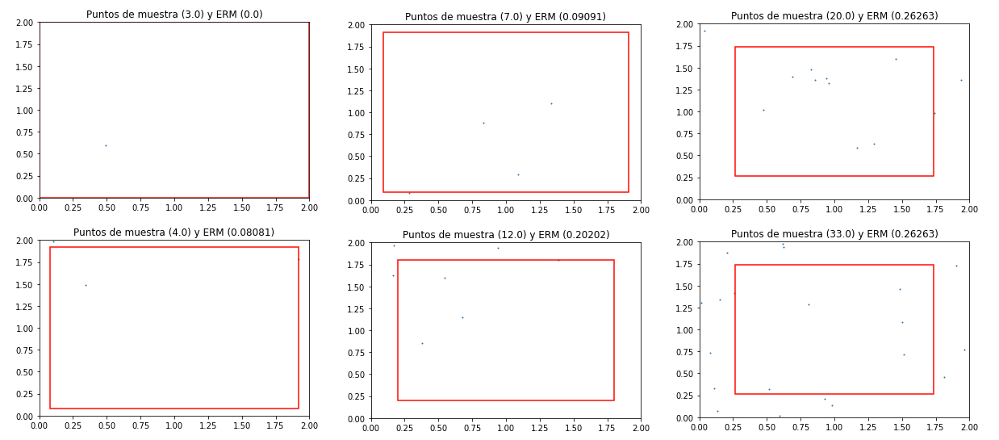
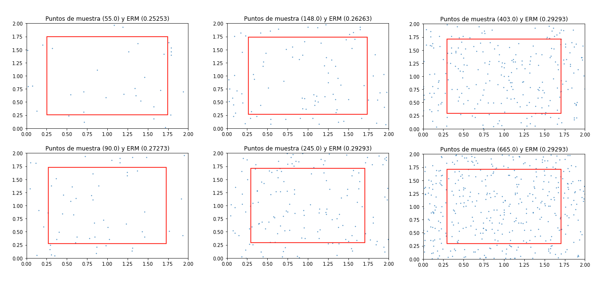

Ahora, graficamos los errores de generalización $$L(D,f)$$ y empírico $$LS$$ para cada hipótesis en $$H$$. Nótese que el error de generalización tiene un mínimo, 0, justo en $$1-\frac{1}{\sqrt 2} = 0.29289...$$. Además, los errores empíricos aproximan bastante bien al error de generalización, que es lo que se espera que pase para muestras suficientemente grandes.

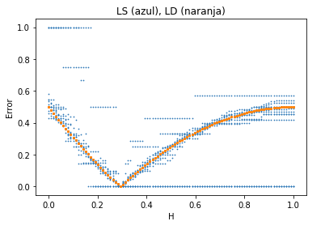

### Errores de generalización para distintos tamaños de muestra

Para cada valor de $$m$$, formamos 1000 conjuntos de entrenamiento, selecciona $$h_S$$ en cada caso y hacemos un histograma del error $$L_{(D,f)}$$. Nótese que a medida que aumentamos el tamaño de las muestras, los errores de generalización van disminuyendo y se empiezan a acumular en 0, existiendo cada vez menos excepciones de errores que sobrepasan al $$\epsilon$$ seleccionado.
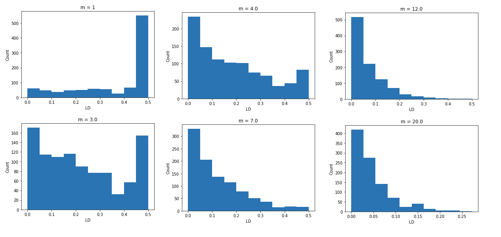
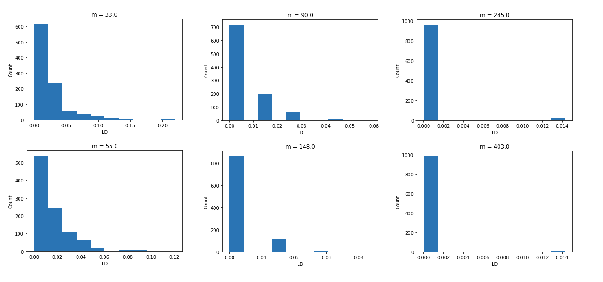
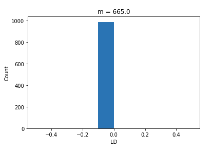

### Conclusión

Como podemos observar en los resultados obtenidos, la complejidad de la muestra $$m_H = log(\mid H \mid/\delta)/\epsilon$$ nos da en la práctica el número de muestras suficientes para asegurarnos que el error de generalización obtenido con el proceso de ERM sea menor que $$\epsilon$$ casi siempre (o con probabilidad de $$1-\delta$$). Y esto es justamente lo que queríamos comprobar de la teoría.

# Modelo PAC generalizado y predictores lineales: Perceptron

## Problemas
Problemas 4, 7 del capítulo 3, problema 1 del capítulo 4, problema 3 del capítulo 9.  [Ver tarea](files/perceptron/PAC_generalizado__perceptron.pdf)

## Trabajo numérico
Implementación del algoritmo de perceptron. [Ver el código del programa](https://github.com/EstuarDiaz/MachineLearning/blob/master/Perceptron.ipynb)

A continuación implementamos el algoritmo del perceptrón. Consideramos la clasificación binaria en $$R^2$$, bajo el supuesto de realizabilidad en la clase de predictores lineales.
### Implementación del algoritmo del perceptron
```markdown
# Algoritmo para encontrar el vector clasificador
def getPerceptron(S,d):
    w = np.zeros(d+1)
    bien_clasificados = 0
    pasos = 0
    registro = [w]
    while bien_clasificados < len(S):
        bien_clasificados = 0
        for i in range(len(S)):
            x = np.r_[1,S[i][:-1]]
            clasificacion = np.sign(np.dot(w,x))
            if clasificacion == S[i][-1]:
                bien_clasificados += 1
            else:
                w = w + S[i][-1] * x
                pasos += 1
                registro.append(w)
    return [w,pasos,registro]
```
### Predictor
Suponeos que el predictor verdader está dado por $$w = (-1,1,1)$$. A continuación se muestra la frontera entre ambas clases, definida por este predictor:

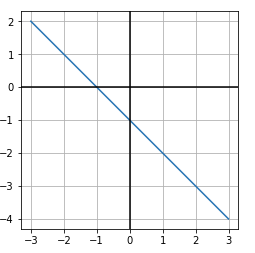

### Obtener muestra
Obtener una muestra: Para simular una distribución homogenea en $$R^2$$, utilizamos una distribución uniforme en el cuadrado $$[-1000,1000]^2$$. Esto debido a que no existe una distribución homogenea en $$R^2$$. Además, la memoria de la computadora es finita, por lo que siempre debemos de acotar nuestra distribución a una región finita.
```markdown
# Obtener una muestra de m elementos
def getSample(m,d,w):
    S = np.random.uniform(-1000,1000,(m,d))
    y = []
    for i in range(len(S)):
        x = np.r_[1,S[i]]
        y.append(np.sign(np.dot(w,x)))
    return np.c_[S,y]
```
### Muestras
Podemos observar las muestras obtenidas para dos iteraciones con $$m=100$$

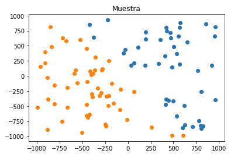
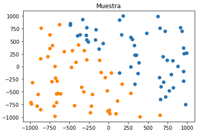

Ahora, para cada $$m=1,2,...,1000$$, formamos 100 conjuntos de entrenamiento, y calculamos el promedio de las normas máximas de los elementos de cada conjunto de entrenamiento. A continuación se muestra cómo escala este promedio respecto al tamaño de muestra.

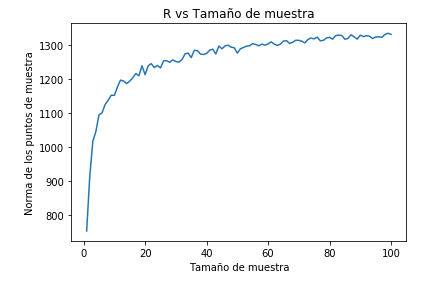
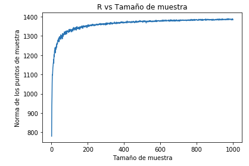

Como se puede observar, las normas máximas aumentan de magnitud conforme el tamaño de la muestra aumenta, y tiende a la norma máxima posible en nuestra distribución.

### Actualizaciones del predictor
A continuación se muestran el número de actualizaciones requeridas para diferentes conjuntos de muestra, respecto al tamaño de los mismos. Como podemos observar, hay ciertos picos en los cuales el algoritmo realiza muchos pasos, pero sin contar esas excepciones o casos especiales, pareciera ser que la cantidad de actualizaciones crece de manera lineal respecto al tamaño de muestra, respecto a una norma de elementos de prueba máxima dada.

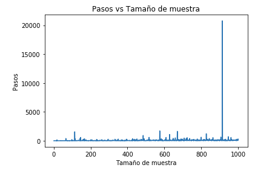
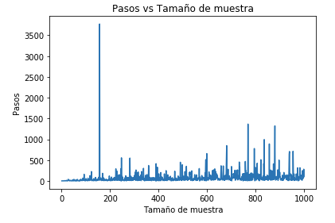


### Secuencia de predictores
Ahora, se muestran dos secuencias de actualizaciones de los predictores. Recordemos que cada predictor representa una recta, pero también se puede representar como un vector tangente y perpendicular a esa recta, que sale del origen. A continuación se muestra la representación de vector, con cola en (0.0) y cabeza en los puntos azules. El punto naranja representa el resultado del algoritmo.

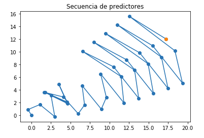
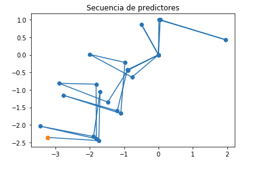

### Predictor vs Muestra
Finalmente, mostramos el predictor obtenido con la última muestra $$(m=100)$$. Como se puede observar, cumple con clasificar correctamente la muestra y se acerca bastante al clasificador real.

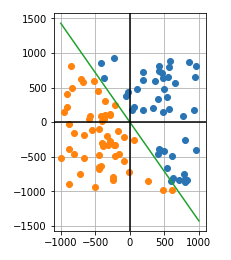
